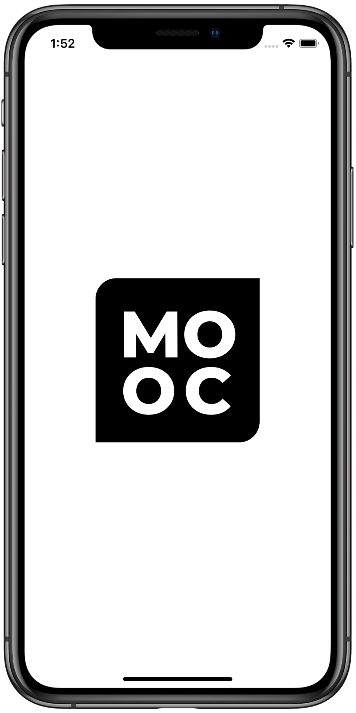

# **MOOC Recommendation Application (iOS)**
### **Introduction:**
Application was developed as part of the group coursework: **"MOOC Recommendation Platform"**. 
***

***
### **Functions:**
* You can easily find some online courses **just for your purposes**.
* Not sure about the chosen course? - Add it to **"Watch later"** category and come back later!
* Now course description contains inner-rating based **only on user's reviews**. Get real feedback here and now!
* Not sure what you are looking for? - Not a problem anymore! Visit **"General"**, new course compilations, that'll help you find something special!
* **JWT-Auth** makes it easier to protect your data, search courses safely and don't worry about your private information!
* Interesting in something specific? - Filter your recommendation using **categories**!
* Enjoyed the course? - Leave a **comment**, so everybody can see how good course is! (Easily delete it if you want to)
***
## Used frameworks and libraries
* **SwiftUI**
* **SwiftLint**
* **Codable**
* **StarRating**
* **KeyChain**

***
## Target operating system
* IOS-14.1+
***